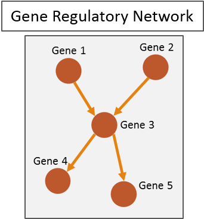
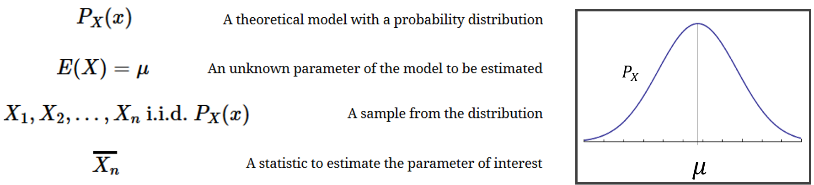
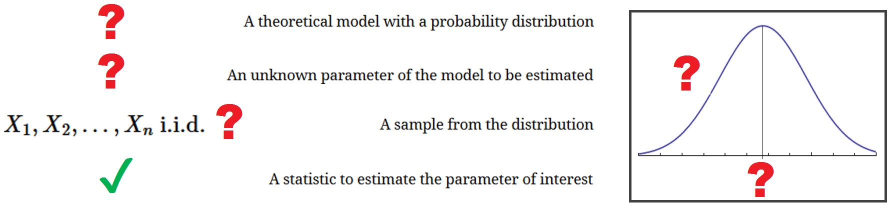
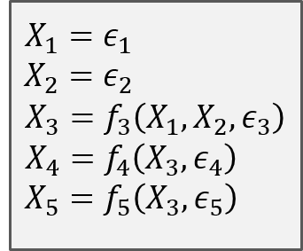
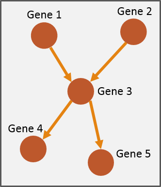
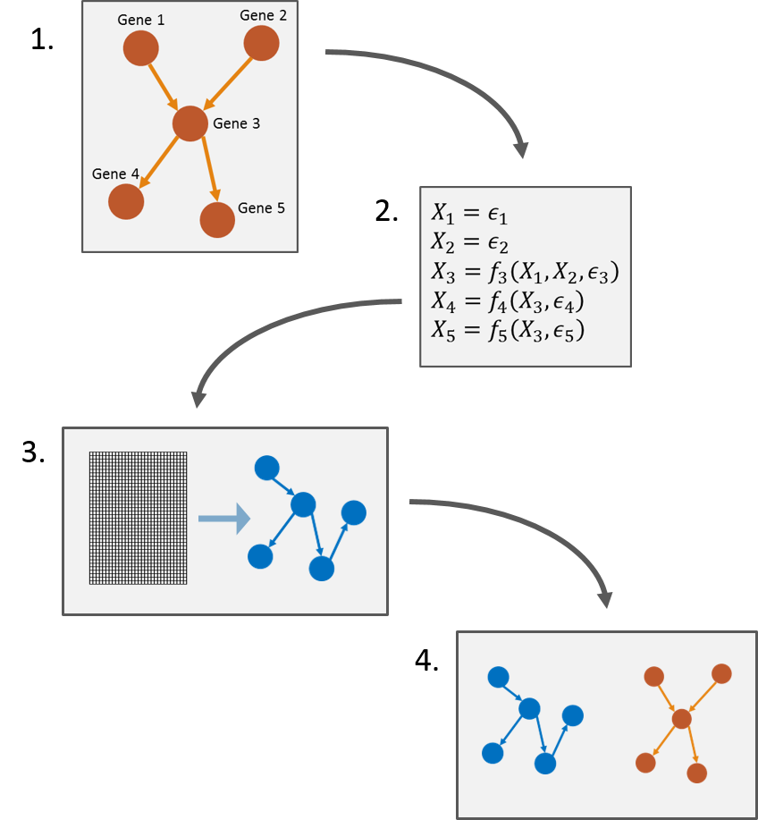
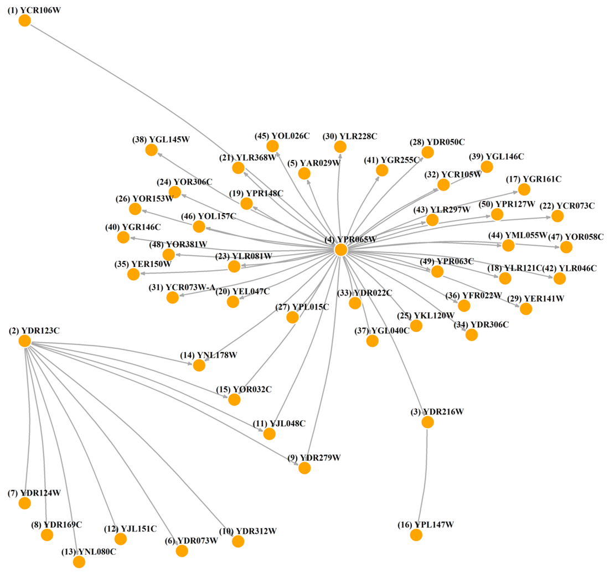
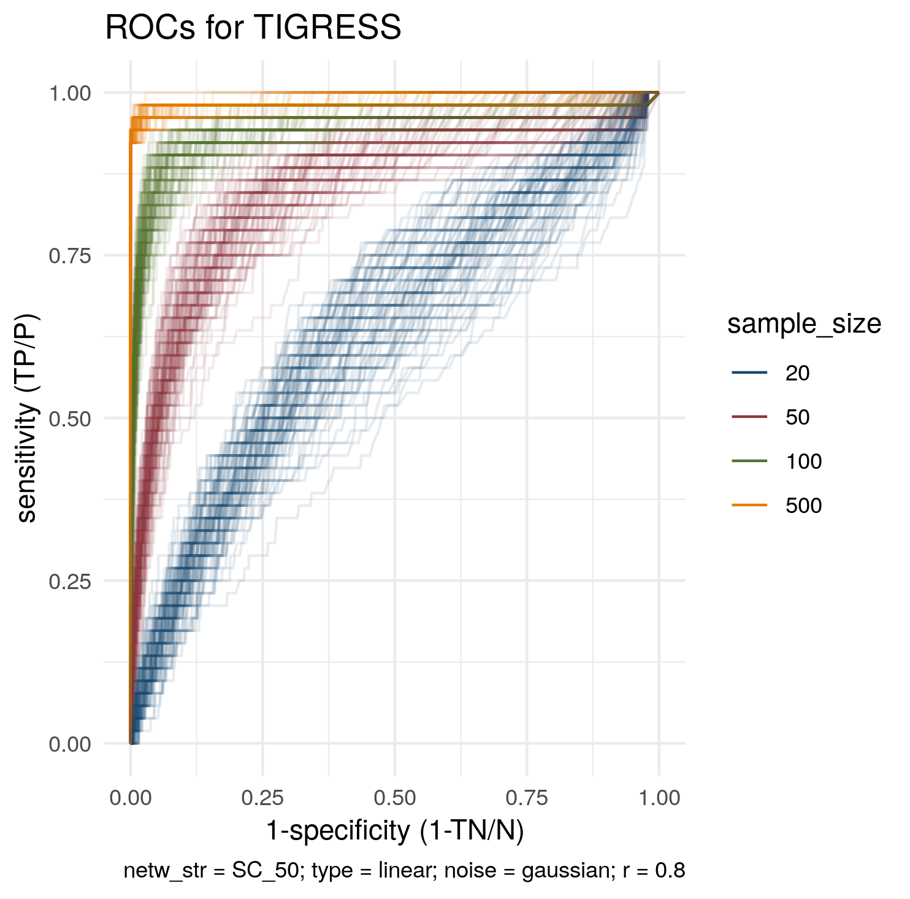
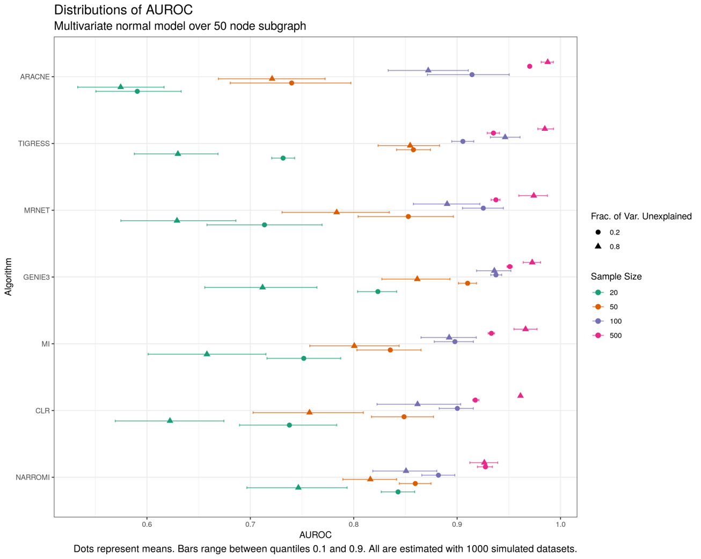
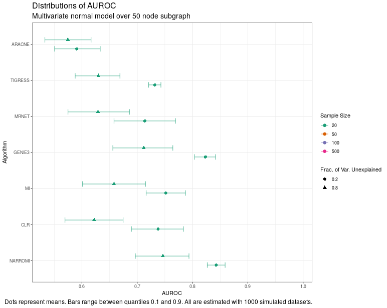

class:left 


```{r setup, include=FALSE}
knitr::opts_chunk$set(echo = FALSE)
```


## The Scientific Model

.pull-left[

Gene regulatory networks (GRNs) are models that aim to encode the regulatory relations among genes in a genome.

- Genes are nodes, regulatory relations are edges.
- Regulatory relations are *causal* (edges are directed, indicate more than co-expression).
- Edges represent *direct* causal effects (indirect effects are directed paths).

GRNs are directed graphs $(V,E)$, which are equivalent to an adjacency matrix.

]

.pull-right[
```{r, out.width = "400px"}

```
]


---

class:left 


## The Theoretical Problem

In bioinformatics there are many methods to build GRNs.

&nbsp;
&nbsp;
&nbsp;

--

Papers introducing them typically test them on given gene expression datasets. They show that the methods work *in practice*.

&nbsp;
&nbsp;
&nbsp;

--

Our question is *do they work well in theory?*

- How dependent is a method on shape of regulatory relations, sample size, noise, etc.?

- How reliable is the method? Are reported results flukes?


---

class:left

## Statistics 101

A basic example of statistical inference. We have:  
&nbsp;
&nbsp;
  
```{r, out.width = "900px"}

```
  
--
&nbsp;
&nbsp;

We ask: **is our statistic a good (reliable, accurate) estimator of our parameter?**

- Basic probability says $\bar{X_n}$ is accurate.
- By the Law of Large Numbers, $\bar{X_n}$ is increasingly accurate as $n \to \infty$.


---

class:left


## The Probabilistic Model

Consider GRN inference algorithms as estimators and look at their statistical properties (unfair).  

--

Estimators of what?
&nbsp;
&nbsp;
  
```{r, out.width = "900px"}

```

---

class:left


## The Probabilistic Model

Consider GRN inference algorithms as estimators and look at their statistical properties (unfair).  


Estimators of what? **A Bayesian Network associated to a causal SEM**.  

--

.pull-left[
#### Causal Structural Equations Model (SEM)

.center[
```{r, out.width = "200px"}

```
]
.Small[
Each equation is a causal mechanism.

The joint distribution of noise variables $\epsilon_i$ determines a joint distribution of gene expressions. This is $P_X(x)$.
]
]

--

.pull-right[

#### Bayesian Network

.center[
```{r, out.width = "150px"}

```
]
.Small[
Assume joint independence of error variables (no unmeasured common causes), and aciclicity (no contemporary causation).

Draw an edge from direct causes to effects. This is a Bayesian Network, **our parameter of interest**.
]
]


---
class:left 


## Methods We Study
.Mid[
.shorties[
.pull-left[
##### Mutual information-based
.small[


.content-box-gray[
##### Mutual information network
Estimate

$$I(X_i, X_j) = E\left(\log\frac{f_{X_i}(X_i)f_{X_j}(X_j) }{f_{X_iX_j}(X_i,X_j)}\right)$$

Filter edges from MI matrix with threshold.
]

.content-box-gray[
##### ARACNe
For each triplet of variables, eliminate edge with lowest estimated MI.
]
.content-box-gray[
##### MRNET
Derive 'minimum redundancy, maximum relevance' score from estimated MI using a step-wise procedure. Threshold.
]
.content-box-gray[
##### CLR
Standardize estimated MI matrix row-wise and column-wise. Average both scores. Threshold.

]
]
]

.pull-right[
##### Regression-based
.small[

.content-box-gray[
##### NARROMI

For each gene, estimate LAD-Lasso. Use coefficients as scores for edges. Threshold.

$$
\hat{\beta} =\text{argmin}_{\beta \in \mathbb{R}^p} |Y-\beta^{\top}X|+\lambda||\beta||_1
$$
]

.content-box-gray[
##### TIGRESS
For each gene, estimate Least Angle Regression (LARS) repeatedly in a bootstrap-like procedure. Use estimates to compute scores of relevance in prediction. Threshold.
]

.content-box-gray[
##### GENIE3
For each gene, estimate an ensemble of regression tress (e.g. random forest). Use estimates to compute scores of relevance in prediction. Threshold.
]
]
]
]
]


---

class:left 

## Workflow


.left-column[
.Small[
1. Set theoretical network to estimate.

2. Generate causal SEMs over this network.

3. Simulate data and apply algorithms.

4. Evaluate algorithm outputs.
]
]
.center[
```{r, out.width = "460px"}

```

]


---

class:left 

## Sub-network

.left-column[

Sub-network extracted from "gold standard" GRN from Sisi Ma *et al.* (2014), using algorithm from Marbach *et al.* (2009). This algorithm maximizes modularity step-wise. Its output preserves some structural properties of its input.

]

.center[

```{r, out.width = "550px"}

```


]


---

class:left


## Causal SEM Definition


* Linear functional form

$$f_i\left(pa\left(X_i\right), \varepsilon_i \right)=\sum_{X_j \in pa(X_i)} \alpha_{ij}X_j + \varepsilon_i$$

--

* Gaussian errors


$$
\varepsilon_{ij}\sim N(0,\sigma^2)
$$

--

* Low and high levels of noise

$$
FVU_i=\frac{Var(\varepsilon_i)}{Var(X_i)}=0.2
$$


$$
FVU_i=\frac{Var(\varepsilon_i)}{Var(X_i)}=0.8
$$

--

Fixed coefficients $\alpha_{ij} \sim U(-1,1)$ throughout.


---

class:left

## Simulations

* For each causal SEM we simulate 1000 datasets of size 20, 50, 100, and 500.

--

* Algorithms are used "out-of-the-box", that is, using parameters suggested by authors.

--

* Implementations in trustworthy packages. NARROMI was translated from Matlab to R code.

--

* Mutual information was estimated with Miller-Madow estimator.

.Small[
$$\hat{H(}X)= - \sum_{b_X \in \text{bins}_X}\hat{p}_{b_X}\log\left(\hat{p}_{b_X}\right)$$
$$\hat{H(}Y)= - \sum_{b_Y \in \text{bins}_Y}\hat{p}_{b_Y}\log\left(\hat{p}_{b_Y}\right)$$

$$\hat{H(X,Y)}= - \sum_{b_{X \times Y} \in \text{bins}_{X\times Y}}\hat{p}_{b_{X\times Y}}\log\left(\hat{p}_{b_{X\times Y}}\right)$$

$$\hat{I(}X,Y)= \hat{H(}X)+\hat{H(}Y)-\hat{H(}X,Y) + \frac{\hat{m}-1}{n}$$
]

---

class:left 

## Assessment of Estimates

.pull-left[
Each algorithm can be seen as a classifier that outputs scores $s_{ij}$ for edges. For each threshold on scores we get

$$
\text{Sensitivity} = \frac{\text{No. of correctly detected edges} }{\text{No. of true edges}}
$$

$$
\text{Specificity} = \frac{\text{No. of correctly detected non-edges} }{\text{No. of true non-edges}}
$$
Over all thresholds, we get a parametric curve - the ROC curve. The area under it, AUROC, is the probability that a randomly sampled true edge has a score higher than that of a  randomly sampled non-edge.

]

.pull-right[

```{r, out.width = "1000px"}

```

]

---

class:left

## Results

---

class:center

```{r, out.width = "800px"}

```


---

class:center

```{r, out.width = "800px"}

```


---

class:left 


## Results

- MI-based algorithms are more variable than regression-based algorithms.

- MI-based algorithms are more sensitive to sample size than regression-based algorithms. ARACNe and NARROMI are the extremes.

- TIGRESS is most sensitive to $FVU$. ARACNe is least sensitive.

- Surprisingly good results for large $n$. Not so much for small $n$. 

- Better results with less noise, except at large sample size. Bias-variance trade-off.


---

class:left 

## Thanks

Thanks.

I'm interested in comments or suggestions.

My email is agzuurp@unal.edu.co, and we can talk outside.


---

class:left 

## References

.Small[.Small[
.pull-left[
Sisi Ma et al. «De-Novo Learning of Genome-Scale Regulatory Networks in S. cerevisiae».  PLOS ONE 9.9 (2014), pages. 1-20. doi: 10.1371/journal.pone.0106479. url: https://doi.org/10.1371/journal.pone.0106479.

Xiujun Zhang et al. «NARROMI: a noise and redundancy reduction technique improves accuracy of gene regulatory network inference».  Bioinformatics 29.1 (2013), pages. 106-113. issn: 1367-4803. doi: 10.1093/bioinformatics/bts619.

Xin Fang et al. «Global transcriptional regulatory network for Escherichia coli robustly connects gene expression to transcription factor activities».  Proceedings of the National Academy of Sciences (2017). issn: 0027-8424. doi: 10.1073/pnas.1702581114. 

Anne-Claire Haury et al. «TIGRESS: Trustful Inference of Gene REgulation using Stability Selection».  BMC Systems Biology 6.1 (2012), pág. 145. issn: 1752-0509. doi: 10.1186/1752-0509-6-145.

Emmert-Streib F, Dehmer M, Haibe-Kains B. «Gene regulatory networks and their applications: understanding biological and medical problems in terms of networks». Front Cell Dev Biol. (2014) 2:38. doi:10.3389/fcell.2014.00038 
]

.pull-right[
Atul J Butte e Isaac S. Kohane. «Mutual information relevance networks: functional genomic clustering using pairwise entropy measurements.»  Pacific Symposium on Biocomputing. Pacific Symposium on Biocomputing (2000), pages. 418-29.

Vân Anh Huynh-Thu et al. «Inferring Regulatory Networks from Expression Data Using Tree-Based Methods».  PLOS ONE 5.9 (2010), pages 1-10. doi: 10.1371/journal.pone.0012776.

Adam A. Margolin et al. «ARACNE: An Algorithm for the Reconstruction of Gene Regulatory Networks in a Mammalian Cellular Context».  BMC Bioinformatics 7 (2006), S7 -S7.

Jeremiah J Faith et al. «Large-Scale Mapping and Validation of Escherichia coli Transcriptional Regulation from a Compendium of Expression Profiles».  PLOS Biology 5.1 (2007), pages. 1-13. doi: 10.1371/journal.pbio.0050008

J. Peters, D. Janzing y B. Schölkopf. Elements of Causal Inference: Foundations and Learning Algorithms. Cambridge, MA, USA: MIT Press, (2017).
]
]
]

